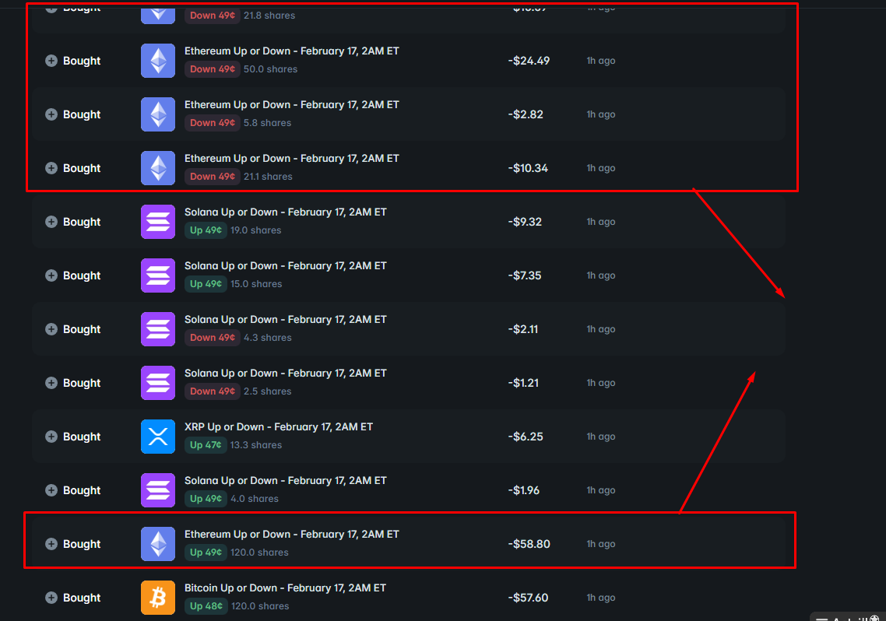

# Polymarket BTC 1hr Monitor

A Rust-based monitoring bot for Polymarket that tracks BTC 1-hour price prediction markets and displays real-time statistics.


**Repository**: 

https://github.com/user-attachments/assets/6a4d2527-4e2c-4ba2-b303-d77e56ec36fc


**Repository**: [github.com/gabagool23/1hour-crypto-polymarket-trading-bot](https://github.com/gabagool23/1hour-crypto-polymarket-trading-bot)

## Overview

This bot continuously monitors the **BTC 1-hour price change prediction market** and displays:
- Up and Down token prices (BID/ASK)
- Time remaining until market closure
- Market statistics

**Note**: This is a **monitoring-only** bot. It does not execute trades.

## Features

- ✅ Real-time price monitoring (BID/ASK prices)
- ✅ Automatic market discovery
- ✅ Automatic market updates when new hour starts
- ✅ Statistics logging to `history.toml`
- ✅ No trading functionality (monitoring only)

## Setup

1. Install Rust (if not already installed):
   ```bash
   curl --proto '=https' --tlsv1.2 -sSf https://sh.rustup.rs | sh
   ```

2. Build the project:
   ```bash
   cargo build --release
   ```

3. Configure the bot (optional):
   - Edit `config.json` (created on first run)
   - Adjust `monitoring.check_interval_ms` if needed (default: 2000ms = 2 seconds)

## Usage

### Run the Monitor

```bash
cargo run
```

The bot will:
1. Discover the current BTC 1h market
2. Start monitoring prices every 2 seconds (configurable)
3. Log statistics to `history.toml`
4. Automatically discover new markets when the hour changes

### Output

The bot displays BTC 1h market statistics in real-time:

```
BTC 1h Up Token BID:$0.52 ASK:$0.54 Down Token BID:$0.45 ASK:$0.47 remaining time:45m 30s
```

**Example (bot test run):**



All logs are also saved to `history.toml` for historical analysis.

## Configuration

The bot creates a `config.json` file on first run. Here's the structure:

```json
{
  "polymarket": {
    "gamma_api_url": "https://gamma-api.polymarket.com",
    "clob_api_url": "https://clob.polymarket.com"
  },
  "monitoring": {
    "check_interval_ms": 2000
  }
}
```

### Configuration Options

- `monitoring.check_interval_ms`: How often to fetch market data (default: 2000ms = 2 seconds)

**Note**: No API credentials are required for monitoring. The bot only uses public endpoints.

## Research Mode

The bot includes a research tool to fetch and analyze trade history from Polymarket's API.

### Quick Start

**Option 1: Using config.json (Recommended)**

1. Add research configuration to `config.json`:
```json
{
  "research": {
    "target_address": "0x1234567890123456789012345678901234567890",
    "condition_id": "0xabcdef1234567890abcdef1234567890abcdef12",
    "output_file": "research.toml"
  }
}
```

2. Run research mode:
```bash
cargo run -- --research
```

**Option 2: Using CLI arguments**

```bash
cargo run -- \
  --research \
  --target-address <WALLET_ADDRESS> \
  --condition-id <CONDITION_ID> \
  --research-output research.toml
```

## How It Works

1. **Market Discovery**: 
   - Automatically discovers the current BTC 1h market using slug pattern `bitcoin-up-or-down-{month}-{day}-{hour}pm-et`
   - Converts UTC time to ET (Eastern Time) for slug matching

2. **Price Monitoring**: 
   - Fetches BID/ASK prices every 2 seconds (configurable)
   - Displays prices and time remaining

3. **Market Updates**: 
   - Automatically discovers new markets when the hour changes
   - Updates monitoring to track the new market

## Notes

- The bot runs continuously until stopped (Ctrl+C)
- All statistics are logged to `history.toml`
- No API credentials needed for monitoring
- The bot automatically handles market transitions

## Contact

- Telegram: [@baker1119](https://t.me/baker1119)
